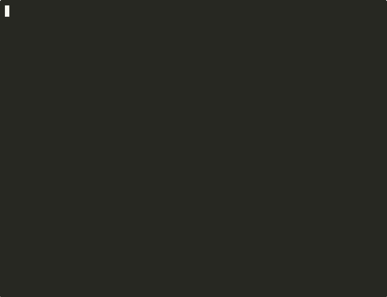

# Solo Builder

> A Python terminal CLI that uses six AI agents and the Anthropic SDK to manage DAG-based project tasks — with a live web dashboard and Discord bot.

[](https://github.com/Vaultifacts/solo-builder/actions/workflows/smoke-test.yml)
[](https://python.org)
[](https://docs.anthropic.com)
[](LICENSE)
[](CHANGELOG.md)


---

## Features

| Feature | Description |
|---|---|
| **DAG task graph** | Projects decompose into Tasks → Branches → Subtasks with explicit dependencies |
| **6 AI agents** | Planner, ShadowAgent, SelfHealer, Executor, Verifier, MetaOptimizer coordinate every step |
| **SdkToolRunner** | Subtasks with tools (Read, Glob, Grep) execute via async Anthropic SDK tool-use — fastest path |
| **AnthropicRunner** | Subtasks without tools call `claude-sonnet-4-6` directly via SDK — no subprocess needed |
| **Claude subprocess** | Fallback runner via `claude -p` headless CLI for tool-use when API key is absent |
| **REVIEW_MODE** | Subtasks pause at magenta `Review` state; advance only via `verify` — full human-in-the-loop |
| **Discord bot** | `/status`, `/run`, `/auto [n]`, `/stop`, `/verify subtask`, `/export` — control the pipeline from Discord; also accepts plain-text commands without `/` prefix |
| **Live web dashboard** | Dark-theme SPA at `http://localhost:5000` polls every 2 s; Run Step + Auto buttons |
| **Self-healing** | SelfHealer detects stalled subtasks and resets them to Pending automatically |
| **Shadow state** | ShadowAgent tracks expected vs actual status, resolves conflicts each step |
| **Process lockfile** | Prevents two CLI instances from corrupting the shared state file |
| **Persistence** | State auto-saves every 5 steps; resume on restart |
| **PDF snapshots** | 4-page matplotlib report at configurable intervals |
| **Runtime config** | `set KEY=VALUE` changes thresholds, model, tokens, delays without restart |

---

## Install

```bash
git clone https://github.com/Vaultifacts/solo-builder.git
cd solo-builder/solo_builder
pip install -r requirements.txt
```

Create a `.env` file (never committed) with your API key:
```
ANTHROPIC_API_KEY=sk-ant-...
```
Or `export ANTHROPIC_API_KEY=sk-ant-...` in your shell.

---

## Usage

### Terminal 1 — CLI
```bash
cd solo_builder
python solo_builder_cli.py

# Headless / scripted:
python solo_builder_cli.py --headless --auto 99 --no-resume
python solo_builder_cli.py --headless --auto 99 --no-resume --export        # write outputs.md after run
python solo_builder_cli.py --headless --auto 99 --no-resume --export \
    --quiet --output-format json                                            # silent, JSON result to stdout
```

### Terminal 2 — Dashboard (optional)
```bash
python api/app.py
# Open http://127.0.0.1:5000
```

### Terminal 3 — Discord Bot (optional)
```bash
# 1. Go to https://discord.com/developers/applications → New Application → Bot
# 2. Reset Token → copy it
# 3. OAuth2 → URL Generator → scopes: bot + applications.commands
#    permissions: Send Messages, Attach Files → invite URL → add to your server
# 4. Add to .env:
#      DISCORD_BOT_TOKEN=<token>
#      DISCORD_CHANNEL_ID=<channel ID>   # optional, restricts to one channel
pip install "discord.py>=2.0"
python discord_bot/bot.py
```

Both slash commands and plain-text work (no `/` prefix needed for plain-text):

| Command | Description |
|---|---|
| `status` / `/status` | DAG progress summary with per-task bar charts |
| `run` / `/run` | Trigger one step (same as the dashboard Run Step button) |
| `auto [n]` / `/auto [n]` | Run N steps automatically; posts a per-step ticker after each step |
| `stop` / `/stop` | Cancel bot auto run + write `state/stop_trigger` so the CLI halts after the current step |
| `verify <ST> [note]` / `/verify` | Approve a Review-gated subtask from Discord |
| `export` / `/export` | Download `solo_builder_outputs.md` as a file attachment |
| `help` / `/help` | Command list |

The bot sends a per-step progress ticker (`Step N — X✅ Y▶ Z⏸ W⏳ / 70`) during `auto` runs and a 🎉 completion notification when all subtasks reach Verified. All messages are logged to `discord_bot/chat.log`.

### Key commands

| Command | Description |
|---|---|
| `auto [N]` | Run N steps automatically (omit N for full run) |
| `run` | Execute one step manually |
| `verify <ST> [note]` | Hard-set a subtask Verified (human gate) |
| `describe <ST> <prompt>` | Assign a custom Claude prompt to a subtask |
| `tools <ST> <tool,list>` | Give a subtask access to Claude tools (Read, Glob, Grep…) |
| `add_task [spec]` | Append a new task; inline spec skips the prompt (e.g. `add_task Build OAuth2 flow`) |
| `add_branch <Task N>` | Add a branch to an existing task |
| `set KEY=VALUE` | Change runtime settings (see below) |
| `export` | Dump all subtask outputs to `solo_builder_outputs.md` |
| `snapshot` | Save a PDF report |
| `reset` | Clear state and restart the diamond DAG |
| `save` / `load` | Manual persistence |
| `exit` | Save and quit |

### Runtime settings
```
set STALL_THRESHOLD=5          # Steps before SelfHealer resets a subtask
set DAG_UPDATE_INTERVAL=5      # Steps between Planner re-prioritization
set MAX_SUBTASKS_PER_BRANCH=20 # Hard cap on subtasks per branch
set MAX_BRANCHES_PER_TASK=10   # Hard cap on branches per task
set ANTHROPIC_MAX_TOKENS=512   # Token budget per SDK call
set ANTHROPIC_MODEL=claude-sonnet-4-6
set CLAUDE_SUBPROCESS=off      # Force all subtasks through SDK (disable subprocess)
set AUTO_STEP_DELAY=0.4        # Seconds between auto steps
set REVIEW_MODE=on             # Pause subtasks at Review before Verified
set VERBOSITY=DEBUG            # INFO | DEBUG
```

---

## Architecture

```
INITIAL_DAG (diamond fan-out / fan-in)

  Task 0 (seed)
    ├─ Branch A  ──┐
    └─ Branch B  ──┤
                   ├──▶ Task 1 ──▶ Task 2 ──▶ Task 3 ──▶ Task 4 ──▶ Task 5 ──▶ Task 6 (synthesis)
                         ...           ...           ...         ...         ...
```

**Per-step pipeline:**
```
Planner → ShadowAgent → SelfHealer → Executor → Verifier → ShadowAgent → MetaOptimizer
```

**Executor routing (per subtask):**
```
tools + ANTHROPIC_API_KEY       →  SdkToolRunner    (async SDK tool-use, fastest)
tools + no API key              →  ClaudeRunner      (subprocess, --allowedTools)
no tools + ANTHROPIC_API_KEY    →  AnthropicRunner   (direct SDK, asyncio.gather)
fallback                        →  dice roll         (probability-based, offline)
```

---

## Project structure

```
solo_builder/
├── solo_builder_cli.py          # Main CLI (~2500 lines) — all 6 agents + 4 runners
├── api/
│   ├── app.py                   # Flask REST API (GET /status /tasks /journal /export, POST /run)
│   └── dashboard.html           # Dark-theme SPA, live polling, Run Step + Auto + Export buttons
├── discord_bot/
│   ├── bot.py                   # Discord bot (slash + plain-text commands, stop guard)
│   └── chat.log                 # Two-way chat log (user messages + bot replies)
├── utils/
│   └── helper_functions.py      # ANSI codes, bars, DAG stats, validators
├── config/
│   └── settings.json            # Runtime config (model, tokens, thresholds…)
├── solo_builder_live_multi_snapshot.py  # 4-page PDF via matplotlib
├── profiler_harness.py          # Standalone perf benchmark (patches async + sync paths)
├── solo_builder_outputs.md      # Exported Claude outputs (auto-generated)
├── requirements.txt
└── state/
    ├── solo_builder_state.json  # DAG + step counter (auto-saved every 5 steps)
    ├── step.txt                 # Heartbeat: step,verified,total,pending,running,review
    ├── run_trigger              # Written by bot/dashboard to trigger one CLI step
    └── verify_trigger.json      # Written by bot to queue a subtask verify
```

---

## Example run

```
  SOLO BUILDER v2.0  │  Step: 20  │  ETA: ~18 steps  (50% done)

  ▶ Task 0  [Verified]
    ├─ Branch A [Verified]  ████████████████████  5/5
    └─ Branch B [Verified]  ████████████████████  3/3

  ▶ Task 1  [Verified]

  ▶ Task 2  [Running]
    ├─ Branch E [Review]    ░░░░░░░░░░░░░░░░░░░░  0/5  ← REVIEW_MODE: awaiting verify
    └─ Branch F [Running]   ████████░░░░░░░░░░░░  2/4

  SDK executing E1, E2, F3, F4…   ← blue: direct Anthropic API calls
  Claude executing O1…            ← cyan: subprocess with Read+Glob+Grep tools

  Overall [══════════════░░░░░░░░] 35✓ 2⏸ 4▶ 29● / 70  (50.0%)

solo-builder > verify E1 output looks correct
  ✓ E1 (Task 2) verified (was Review). Note: output looks correct
```

---

## Configuration (`config/settings.json`)

```json
{
  "STALL_THRESHOLD": 5,
  "DAG_UPDATE_INTERVAL": 5,
  "MAX_SUBTASKS_PER_BRANCH": 20,
  "MAX_BRANCHES_PER_TASK": 10,
  "JOURNAL_PATH": "journal.md",
  "ANTHROPIC_MODEL": "claude-sonnet-4-6",
  "ANTHROPIC_MAX_TOKENS": 512,
  "CLAUDE_TIMEOUT": 60,
  "AUTO_STEP_DELAY": 0.4,
  "EXECUTOR_MAX_PER_STEP": 6,
  "EXECUTOR_VERIFY_PROBABILITY": 0.6,
  "REVIEW_MODE": false,
  "WEBHOOK_URL": ""
}
```

---

## Development

### Running tests

```bash
# Bot unit tests (21 tests, no Discord connection needed, ~0.03 s)
python discord_bot/test_bot.py

# Or via pytest
python -m pytest discord_bot/test_bot.py -v
```

### CI smoke test (GitHub Actions)

The workflow at `.github/workflows/smoke-test.yml` runs on every push/PR to `master`:

| Step | What it checks |
|---|---|
| **15-step headless run** | `--auto 15 --no-resume` — asserts ≥ 18 subtasks Verified |
| **Export command** | `--headless --export --no-resume --auto 2` — asserts `solo_builder_outputs.md` exists and is > 30 bytes |
| **stop_trigger cleanup** | Plants a stale `state/stop_trigger` before startup; asserts it's consumed and pipeline advances |
| **Bot unit tests** | 112 tests covering `_has_work`, `_format_status`, `_auto_running`, `_read_heartbeat`, `_format_step_line`, `_load_state`, `_handle_text_command`, `_run_auto`, `_fire_completion`, `_cmd_add_task`, `_cmd_add_branch`, `_cmd_verify`, `_cmd_describe`, `_cmd_tools`, `_cmd_set`, `_cmd_reset`, `_cmd_export`, `_cmd_status`, `_cmd_depends`, `_cmd_undepends`, `_cmd_output`, `save_state`, `load_state`, `_take_snapshot`, `_cmd_prioritize_branch`, `add_task` inline spec |
| **Profiler dry-run** | `profiler_harness.py --dry-run` runs 3 steps; asserts executor + planner patches fire without error |
| **REVIEW_MODE gate** | Sets `REVIEW_MODE=True`, runs 2 steps, asserts ≥ 1 subtask in `Review` state |
| **Webhook POST** | Starts a local `http.server`, calls `_fire_completion()` directly, asserts correct JSON payload received and no error log written |

### Performance profiling

```bash
python profiler_harness.py
```

Patches all SDK/subprocess paths at module level — no production code changes. Outputs per-agent timing, concurrency stats, and planner cache hit rate. Optimal config: `EXECUTOR_MAX_PER_STEP=6` (157 s wall / 70 subtasks with live API; 29 s in dice-roll mode).

### Priority cache architecture

The Planner's `prioritize()` result is cached for `DAG_UPDATE_INTERVAL` steps (default 5). The cache also refreshes immediately when the count of fully-Verified tasks increases — this prevents a stall where newly-unlocked tasks (e.g. Tasks 1–5 after Task 0 completes) are invisible to the executor until the next scheduled refresh.

### REVIEW_MODE

Set `REVIEW_MODE=true` in `config/settings.json` (or `set REVIEW_MODE=true` at the CLI prompt) to enable human-in-the-loop gating. Subtasks that would normally auto-verify are paused at `Review` status. Advance them individually:

```
solo-builder > verify A3 checked and looks correct
  ✓ A3 (Task 0) verified (was Review). Note: checked and looks correct
```


