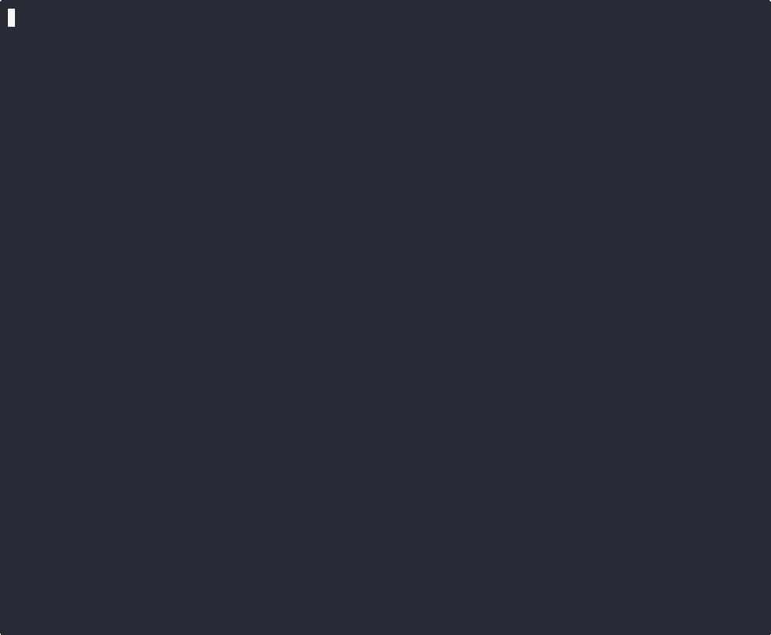

# Solo Builder

> A Python terminal CLI that uses six AI agents and the Anthropic SDK to manage DAG-based project tasks — with a live web dashboard.

[](https://github.com/Vaultifacts/solo-builder/actions/workflows/smoke-test.yml)
[](https://python.org)
[](https://docs.anthropic.com)
[](LICENSE)



---

## Features

| Feature | Description |
|---|---|
| **DAG task graph** | Projects decompose into Tasks → Branches → Subtasks with explicit dependencies |
| **6 AI agents** | Planner, ShadowAgent, SelfHealer, Executor, Verifier, MetaOptimizer coordinate every step |
| **Anthropic SDK runner** | Subtasks without tools execute via direct `claude-sonnet-4-6` API calls — no subprocess |
| **Claude subprocess runner** | Subtasks with `tools` (Read, Glob, Grep…) run via `claude -p` headless CLI |
| **Live web dashboard** | Dark-theme SPA at `http://localhost:5000` polls every 2 s; Run Step button |
| **Self-healing** | SelfHealer detects stalled subtasks and resets them to Pending automatically |
| **Shadow state** | ShadowAgent tracks expected vs actual status, resolves conflicts each step |
| **Human gates** | `verify <subtask> [note]` hard-sets any subtask Verified with an audit note |
| **Process lockfile** | Prevents two CLI instances from corrupting the shared state file |
| **Persistence** | State auto-saves every 5 steps; resume on restart |
| **PDF snapshots** | 4-page matplotlib report at configurable intervals |
| **Runtime config** | `set KEY=VALUE` changes thresholds, model, tokens, delays without restart |

---

## Install

```bash
git clone https://github.com/Vaultifacts/solo-builder.git
cd solo-builder/solo_builder
pip install -r requirements.txt
export ANTHROPIC_API_KEY=sk-ant-...
```

---

## Usage

### Terminal 1 — CLI
```bash
cd solo_builder
python solo_builder_cli.py
```

### Terminal 2 — Dashboard (optional)
```bash
python api/app.py
# Open http://127.0.0.1:5000
```

### Key commands

| Command | Description |
|---|---|
| `auto [N]` | Run N steps automatically (omit N for full run) |
| `run` | Execute one step manually |
| `verify <ST> [note]` | Hard-set a subtask Verified (human gate) |
| `describe <ST> <prompt>` | Assign a custom Claude prompt to a subtask |
| `tools <ST> <tool,list>` | Give a subtask access to Claude tools (Read, Glob, Grep…) |
| `add_task` | Append a new task; Claude decomposes spec into subtasks |
| `add_branch <Task N>` | Add a branch to an existing task |
| `set KEY=VALUE` | Change runtime settings (see below) |
| `export` | Dump all subtask outputs to `solo_builder_outputs.md` |
| `snapshot` | Save a PDF report |
| `reset` | Clear state and restart the diamond DAG |
| `save` / `load` | Manual persistence |
| `exit` | Save and quit |

### Runtime settings
```
set STALL_THRESHOLD=5          # Steps before SelfHealer resets a subtask
set DAG_UPDATE_INTERVAL=1      # Steps between Planner re-prioritization (1=every step)
set MAX_SUBTASKS_PER_BRANCH=20 # Hard cap on subtasks per branch (enforced at add_task/add_branch)
set MAX_BRANCHES_PER_TASK=10   # Hard cap on branches per task (enforced at add_branch)
set ANTHROPIC_MAX_TOKENS=1024  # Token budget per SDK call
set ANTHROPIC_MODEL=claude-sonnet-4-6
set CLAUDE_SUBPROCESS=off      # Force all subtasks through SDK (disable subprocess)
set AUTO_STEP_DELAY=0.4        # Seconds between auto steps
set REVIEW_MODE=on             # Pause subtasks at Review before Verified
set VERBOSITY=DEBUG            # INFO | DEBUG
```

---

## Architecture

```
INITIAL_DAG (diamond fan-out / fan-in)

  Task 0 (seed)
    ├─ Branch A  ──┐
    └─ Branch B  ──┤
                   ├──▶ Task 1 ──▶ Task 2 ──▶ Task 3 ──▶ Task 4 ──▶ Task 5 ──▶ Task 6 (synthesis)
                         ...           ...           ...         ...         ...
```

**Per-step pipeline:**
```
Planner → ShadowAgent → SelfHealer → Executor → Verifier → ShadowAgent → MetaOptimizer
```

**Executor routing (per subtask):**
```
has tools + claude CLI available  →  ClaudeRunner  (subprocess, --allowedTools)
no tools + ANTHROPIC_API_KEY set  →  AnthropicRunner  (direct SDK, parallel)
fallback                          →  dice roll  (probability-based verification)
```

---

## Project structure

```
solo_builder/
├── solo_builder_cli.py          # Main CLI (~2000 lines) — all 6 agents + 3 runners
├── api/
│   ├── app.py                   # Flask REST API (GET /status /tasks /journal /export, POST /run)
│   └── dashboard.html           # Dark-theme SPA, live polling, Run Step + Auto + Export buttons
├── utils/
│   └── helper_functions.py      # ANSI codes, bars, DAG stats, validators
├── config/
│   └── settings.json            # Runtime config (model, tokens, thresholds…)
├── solo_builder_live_multi_snapshot.py  # 4-page PDF via matplotlib
├── profiler_harness.py          # Standalone perf benchmark (patches async + sync paths)
├── solo_builder_outputs.md      # Exported Claude outputs (auto-generated)
└── requirements.txt
```

---

## Example run

```
  SOLO BUILDER — AI AGENT CLI  │  Step: 42  │  ETA: ~28 steps  (60% done)

  ▶ Task 0  [Verified]
    ├─ Branch A [Verified]  ████████████████████  5/5
    └─ Branch B [Verified]  ████████████████████  3/3

  ▶ Task 1  [Running]
    ├─ Branch C [Running]   ████████░░░░░░░░░░░░  2/4
    └─ Branch D [Verified]  ████████████████████  2/2
  ...

  SDK executing C3, C4…          ← blue: direct Anthropic API calls
  Claude executing O1…           ← cyan: subprocess with Read+Glob+Grep tools

  Overall [████████████░░░░░░░░] 42✓ 2▶ 26● / 70  (60.0%)
```

---

## Configuration (`config/settings.json`)

```json
{
  "STALL_THRESHOLD": 5,
  "DAG_UPDATE_INTERVAL": 5,
  "MAX_SUBTASKS_PER_BRANCH": 20,
  "MAX_BRANCHES_PER_TASK": 10,
  "JOURNAL_PATH": "journal.md",
  "ANTHROPIC_MODEL": "claude-sonnet-4-6",
  "ANTHROPIC_MAX_TOKENS": 512,
  "CLAUDE_TIMEOUT": 60,
  "AUTO_STEP_DELAY": 0.4,
  "EXECUTOR_MAX_PER_STEP": 6,
  "EXECUTOR_VERIFY_PROBABILITY": 0.6,
  "REVIEW_MODE": false,
  "WEBHOOK_URL": ""
}
```
