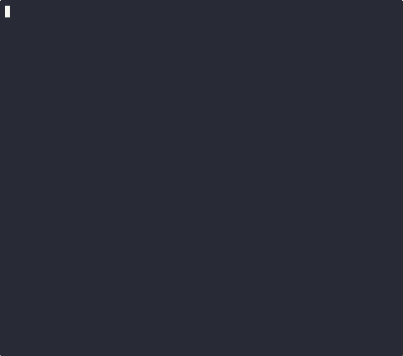

# Solo Builder

> A Python terminal CLI that uses six AI agents and the Anthropic SDK to manage DAG-based project tasks — with a live web dashboard and Discord bot.

[](https://github.com/Vaultifacts/solo-builder/actions/workflows/smoke-test.yml)
[](https://python.org)
[](https://docs.anthropic.com)
[](LICENSE)
[](CHANGELOG.md)



---

## Features

| Feature | Description |
|---|---|
| **DAG task graph** | Projects decompose into Tasks → Branches → Subtasks with explicit dependencies |
| **6 AI agents** | Planner, ShadowAgent, SelfHealer, Executor, Verifier, MetaOptimizer coordinate every step |
| **SdkToolRunner** | Subtasks with tools (Read, Glob, Grep) execute via async Anthropic SDK tool-use — fastest path |
| **AnthropicRunner** | Subtasks without tools call `claude-sonnet-4-6` directly via SDK — no subprocess needed |
| **Claude subprocess** | Fallback runner via `claude -p` headless CLI for tool-use when API key is absent |
| **REVIEW_MODE** | Subtasks pause at magenta `Review` state; advance only via `verify` — full human-in-the-loop |
| **Discord bot** | 37 slash commands + 31 plain-text commands — `/status`, `/run`, `/auto`, `/stop`, `/verify`, `/output`, `/describe`, `/tools`, `/set`, `/depends`, `/undepends`, `/add_task`, `/add_branch`, `/prioritize_branch`, `/reset`, `/snapshot`, `/export`, `/undo`, `/config`, `/branches`, `/graph`, `/filter`, `/priority`, `/stalled`, `/heal`, `/agents`, `/forecast`, `/history`, `/rename`, `/diff`, `/timeline`, `/heartbeat`, `/search`, `/log`, `/stats`, `/tasks`, `/help`; control the full pipeline from Discord; plain-text works too (no `/` needed) |
| **Live web dashboard** | Dark-theme SPA at `http://localhost:5000` polls every 2 s; Run Step, Auto, Export, Verify, Describe, Tools, Set buttons |
| **Self-healing** | SelfHealer detects stalled subtasks and resets them to Pending automatically |
| **Shadow state** | ShadowAgent tracks expected vs actual status, resolves conflicts each step |
| **Process lockfile** | Prevents two CLI instances from corrupting the shared state file |
| **Persistence** | State auto-saves every 5 steps; resume on restart |
| **PDF snapshots** | 4-page matplotlib report at configurable intervals |
| **Runtime config** | `set KEY=VALUE` changes thresholds, model, tokens, delays without restart |

---

## Install

```bash
git clone https://github.com/Vaultifacts/solo-builder.git
cd solo-builder/solo_builder
pip install -r requirements.txt
```

---

## Setup

### Prerequisites

| Requirement | Version | Notes |
|---|---|---|
| **Python** | 3.13+ | `python --version` to verify |
| **pip** | any | Bundled with Python |
| **Git** | 2.x+ | For cloning and CI |
| **Anthropic API key** | — | Optional — without it, subtasks fall back to dice-roll mode |
| **Discord bot token** | — | Optional — only needed for the Discord bot |

### 1. Create a virtual environment (recommended)

```bash
python -m venv venv
# Activate:
source venv/bin/activate        # Linux / macOS / Git Bash
venv\Scripts\activate            # Windows cmd / PowerShell
```

### 2. Install dependencies

```bash
pip install -r requirements.txt
```

For the Discord bot (optional):
```bash
pip install "discord.py>=2.0" python-dotenv
```

### 3. Configure environment variables

Create a `.env` file in the `solo_builder/` directory (never committed):

```
ANTHROPIC_API_KEY=sk-ant-...
```

Or export directly in your shell:
```bash
export ANTHROPIC_API_KEY=sk-ant-...
```

For the Discord bot, add these to `.env` as well:
```
DISCORD_BOT_TOKEN=<your bot token>
DISCORD_CHANNEL_ID=<channel ID>   # optional — restricts bot to one channel
```

### 4. Verify the install

```bash
# Quick smoke test — runs 3 steps in dice-roll mode, no API key needed:
python profiler_harness.py --dry-run

# Or start the CLI interactively:
python solo_builder_cli.py
```

You should see the Solo Builder banner and the `solo-builder >` prompt. Type `help` to list commands, or `auto 5` to run 5 steps.

### 5. Optional components

| Component | How to start | Default URL |
|---|---|---|
| **Web dashboard** | `python api/app.py` | `http://127.0.0.1:5000` |
| **Discord bot** | `python discord_bot/bot.py` | — |
| **PDF snapshots** | `snapshot` command in CLI | Saves to `solo_builder/` |

All three are optional and can run alongside the CLI in separate terminals.

---

## Usage

### Terminal 1 — CLI
```bash
cd solo_builder
python solo_builder_cli.py

# Headless / scripted:
python solo_builder_cli.py --headless --auto 99 --no-resume
python solo_builder_cli.py --headless --auto 99 --no-resume --export        # write outputs.md after run
python solo_builder_cli.py --headless --auto 99 --no-resume --export \
    --quiet --output-format json                                            # silent, JSON result to stdout
```

### Terminal 2 — Dashboard (optional)
```bash
python api/app.py
# Open http://127.0.0.1:5000
```

### Terminal 3 — Discord Bot (optional)
```bash
# 1. Go to https://discord.com/developers/applications → New Application → Bot
# 2. Reset Token → copy it
# 3. OAuth2 → URL Generator → scopes: bot + applications.commands
#    permissions: Send Messages, Attach Files → invite URL → add to your server
# 4. Add to .env:
#      DISCORD_BOT_TOKEN=<token>
#      DISCORD_CHANNEL_ID=<channel ID>   # optional, restricts to one channel
pip install "discord.py>=2.0"
python discord_bot/bot.py
```

Both slash commands and plain-text work (no `/` prefix needed for plain-text):

| Command | Description |
|---|---|
| `status` / `/status` | DAG progress summary with per-task bar charts |
| `run` / `/run` | Trigger one step (same as the dashboard Run Step button) |
| `auto [n]` / `/auto [n]` | Run N steps automatically; posts a per-step ticker after each step |
| `stop` / `/stop` | Cancel bot auto run + write `state/stop_trigger` so the CLI halts after the current step |
| `verify <ST> [note]` / `/verify` | Approve a Review-gated subtask from Discord |
| `output <ST>` / `/output` | Show Claude output for a specific subtask |
| `describe <ST> <prompt>` / `/describe` | Assign a custom Claude prompt to a subtask; queued at next step boundary |
| `tools <ST> <tools>` / `/tools` | Set allowed tools for a subtask (e.g. `Read,Glob,Grep` or `none`) |
| `add_task <spec>` / `/add_task` | Queue a new task; CLI adds it at the next step boundary |
| `add_branch <task> <spec>` / `/add_branch` | Queue a new branch on an existing task |
| `prioritize_branch <task> <branch>` / `/prioritize_branch` | Boost a branch's Pending subtasks to front of queue |
| `set KEY=VALUE` / `/set key value` | Change a runtime setting; queued at next step boundary |
| `set KEY` / `/set key` | Show current value of a setting (reads `config/settings.json`) |
| `depends [<task> <dep>]` / `/depends` | Add a dependency or show the dep graph |
| `undepends <task> <dep>` / `/undepends` | Remove a dependency |
| `pause` / `/pause` | Pause auto-run (resume continues from same position) |
| `resume` / `/resume` | Resume a paused auto-run |
| `reset confirm` / `/reset confirm:yes` | Reset DAG to initial state (destructive — requires confirmation) |
| `snapshot` / `/snapshot` | Trigger a PDF timeline snapshot; attaches latest PDF if available |
| `export` / `/export` | Download `solo_builder_outputs.md` as a file attachment |
| `undo` / `/undo` | Undo last step (restore from backup) |
| `config` / `/config` | Show all current runtime settings |
| `diff` / `/diff` | Show what changed since last save |
| `timeline <ST>` / `/timeline` | Show status history timeline for a subtask |
| `stats` / `/stats` | Per-task breakdown (verified count, avg steps) |
| `history [N]` / `/history` | Last N status transitions (default 20) |
| `search <keyword>` / `/search` | Find subtasks by keyword in name/description/output |
| `filter <status>` / `/filter` | Show subtasks matching a status (Verified/Running/Pending/Review) |
| `priority` / `/priority` | Show which subtasks execute next (ranked by risk score) |
| `stalled` / `/stalled` | Show subtasks stuck longer than STALL_THRESHOLD |
| `heal <ST>` / `/heal` | Reset a Running subtask to Pending |
| `agents` / `/agents` | Show all agent statistics |
| `forecast` / `/forecast` | Detailed completion forecast with ETA |
| `tasks` / `/tasks` | Per-task summary table (verified/total/%) |
| `log [ST]` / `/log` | Show journal entries (optionally filtered to one subtask) |
| `graph` / `/graph` | Visual ASCII DAG dependency graph |
| `branches [Task N]` / `/branches` | List branches for a task with subtask counts |
| `rename <ST> <desc>` / `/rename` | Update a subtask's description |
| `output <ST>` / `/output` | Show Claude output for a specific subtask |
| `heartbeat` / `/heartbeat` | Live counters from `state/step.txt` |
| `help` / `/help` | Command list |

The bot sends a per-step progress ticker (`Step N — X✅ Y▶ Z⏸ W⏳ / 70`) during `auto` runs and a 🎉 completion notification when all subtasks reach Verified. All messages are logged to `discord_bot/chat.log`.

### Key commands

| Command | Description |
|---|---|
| `auto [N]` | Run N steps automatically (omit N for full run) |
| `run` | Execute one step manually |
| `verify <ST> [note]` | Hard-set a subtask Verified (human gate) |
| `describe <ST> <prompt>` | Assign a custom Claude prompt to a subtask |
| `tools <ST> <tool,list>` | Give a subtask access to Claude tools (Read, Glob, Grep…) |
| `add_task [spec \| depends: N]` | Append a new task; inline spec skips the prompt; optional `\| depends: N` overrides auto-wiring |
| `add_branch <Task N> [spec]` | Add a branch to an existing task; inline spec skips the prompt |
| `depends [<task> <dep>]` | Add a dependency or show the dep graph |
| `undepends <task> <dep>` | Remove a dependency |
| `prioritize_branch <Task N> <branch>` | Boost a branch's subtasks to front of priority queue |
| `set KEY=VALUE` | Change runtime settings (see below) |
| `filter <status>` | Show subtasks by status (Verified/Running/Pending/Review) |
| `search <keyword>` | Find subtasks by keyword |
| `stalled` | List subtasks stuck beyond STALL_THRESHOLD |
| `heal <ST>` | Reset a Running subtask to Pending |
| `agents` | Show all agent statistics |
| `forecast` | Detailed completion forecast with ETA |
| `tasks` | Per-task summary table (verified/total/%) |
| `pause` / `resume` | Pause and resume auto-run |
| `undo` | Restore from pre-step backup |
| `diff` | Show changes since last save |
| `export` | Dump all subtask outputs to `solo_builder_outputs.md` |
| `snapshot` | Save a PDF report |
| `reset` | Clear state and restart the diamond DAG |
| `save` / `load` | Manual persistence |
| `exit` | Save and quit |

### Runtime settings
Changes persist to `config/settings.json` automatically (survive restart).
Use `set KEY` (no `=`) to print the current value.
```
set STALL_THRESHOLD=5          # Steps before SelfHealer resets a subtask
set DAG_UPDATE_INTERVAL=5      # Steps between Planner re-prioritization
set MAX_SUBTASKS_PER_BRANCH=20 # Hard cap on subtasks per branch
set MAX_BRANCHES_PER_TASK=10   # Hard cap on branches per task
set ANTHROPIC_MAX_TOKENS=512   # Token budget per SDK call
set ANTHROPIC_MODEL=claude-sonnet-4-6
set CLAUDE_SUBPROCESS=off      # Force all subtasks through SDK (disable subprocess)
set AUTO_STEP_DELAY=0.4        # Seconds between auto steps
set REVIEW_MODE=on             # Pause subtasks at Review before Verified
set VERBOSITY=DEBUG            # INFO | DEBUG
```

---

## Architecture

```
INITIAL_DAG (diamond fan-out / fan-in)

  Task 0 (seed)
    ├─ Branch A  ──┐
    └─ Branch B  ──┤
                   ├──▶ Task 1 ──▶ Task 2 ──▶ Task 3 ──▶ Task 4 ──▶ Task 5 ──▶ Task 6 (synthesis)
                         ...           ...           ...         ...         ...
```

**Per-step pipeline:**
```
Planner → ShadowAgent → SelfHealer → Executor → Verifier → ShadowAgent → MetaOptimizer
```

**Executor routing (per subtask):**
```
tools + ANTHROPIC_API_KEY       →  SdkToolRunner    (async SDK tool-use, fastest)
tools + no API key              →  ClaudeRunner      (subprocess, --allowedTools)
no tools + ANTHROPIC_API_KEY    →  AnthropicRunner   (direct SDK, asyncio.gather)
fallback                        →  dice roll         (probability-based, offline)
```

---

## Project structure

```
solo_builder/
├── solo_builder_cli.py          # Main CLI (~3500 lines) — all 6 agents + 4 runners, 42 commands
├── api/
│   ├── app.py                   # Flask REST API — 19 GET + 11 POST endpoints
│   ├── dashboard.html           # Dark-theme SPA — 10 sidebar tabs, live 2s polling
│   └── test_app.py              # 74 API unit tests
├── discord_bot/
│   ├── bot.py                   # Discord bot — 37 slash + 31 plain-text commands
│   ├── test_bot.py              # 194 bot unit tests
│   └── chat.log                 # Two-way chat log (user messages + bot replies)
├── utils/
│   └── helper_functions.py      # ANSI codes, bars, DAG stats, validators
├── config/
│   └── settings.json            # Runtime config (model, tokens, thresholds…)
├── solo_builder_live_multi_snapshot.py  # 4-page PDF via matplotlib
├── profiler_harness.py          # Standalone perf benchmark (patches async + sync paths)
├── solo_builder_outputs.md      # Exported Claude outputs (auto-generated)
├── requirements.txt
└── state/
    ├── solo_builder_state.json  # DAG + step counter (auto-saved every 5 steps)
    ├── step.txt                 # Heartbeat: step,verified,total,pending,running,review
    ├── run_trigger              # Written by bot/dashboard to trigger one CLI step
    └── verify_trigger.json      # Written by bot to queue a subtask verify
```

---

## Example run

```
  SOLO BUILDER v2.0  │  Step: 20  │  ETA: ~18 steps  (50% done)

  ▶ Task 0  [Verified]
    ├─ Branch A [Verified]  ████████████████████  5/5
    └─ Branch B [Verified]  ████████████████████  3/3

  ▶ Task 1  [Verified]

  ▶ Task 2  [Running]
    ├─ Branch E [Review]    ░░░░░░░░░░░░░░░░░░░░  0/5  ← REVIEW_MODE: awaiting verify
    └─ Branch F [Running]   ████████░░░░░░░░░░░░  2/4

  SDK executing E1, E2, F3, F4…   ← blue: direct Anthropic API calls
  Claude executing O1…            ← cyan: subprocess with Read+Glob+Grep tools

  Overall [══════════════░░░░░░░░] 35✓ 2⏸ 4▶ 29● / 70  (50.0%)

solo-builder > verify E1 output looks correct
  ✓ E1 (Task 2) verified (was Review). Note: output looks correct
```

---

## Configuration (`config/settings.json`)

```json
{
  "STALL_THRESHOLD": 5,
  "DAG_UPDATE_INTERVAL": 5,
  "MAX_SUBTASKS_PER_BRANCH": 20,
  "MAX_BRANCHES_PER_TASK": 10,
  "JOURNAL_PATH": "journal.md",
  "ANTHROPIC_MODEL": "claude-sonnet-4-6",
  "ANTHROPIC_MAX_TOKENS": 512,
  "CLAUDE_TIMEOUT": 60,
  "AUTO_STEP_DELAY": 0.4,
  "EXECUTOR_MAX_PER_STEP": 6,
  "EXECUTOR_VERIFY_PROBABILITY": 0.6,
  "REVIEW_MODE": false,
  "WEBHOOK_URL": ""
}
```

---

## Development

### Running tests

```bash
# Bot unit tests (194 tests, no Discord connection needed, ~5 s)
python discord_bot/test_bot.py

# API unit tests (74 tests, no running server needed)
python api/test_app.py

# All tests via pytest (268 total)
python -m pytest discord_bot/test_bot.py api/test_app.py -v
```

### TASK-001 smoke test

```bash
# Minimal repository-readiness smoke test used by TASK-001
python -m unittest solo_builder.tests.test_task001_smoke -v
```

### CI smoke test (GitHub Actions)

The workflow at `.github/workflows/smoke-test.yml` runs on every push/PR to `master`:

| Step | What it checks |
|---|---|
| **15-step headless run** | `--auto 15 --no-resume` — asserts ≥ 18 subtasks Verified |
| **Export command** | `--headless --export --no-resume --auto 2` — asserts `solo_builder_outputs.md` exists and is > 30 bytes |
| **stop_trigger cleanup** | Plants a stale `state/stop_trigger` before startup; asserts it's consumed and pipeline advances |
| **Bot unit tests** | 194 tests covering all commands and helpers — `_has_work`, `_format_status`, `_auto_running`, `_read_heartbeat`, `_format_step_line`, `_load_state`, `_handle_text_command`, `_run_auto`, `_fire_completion`, `_cmd_add_task`, `_cmd_add_branch`, `_cmd_verify`, `_cmd_describe`, `_cmd_tools`, `_cmd_set`, `_cmd_reset`, `_cmd_export`, `_cmd_status`, `_cmd_depends`, `_cmd_undepends`, `_cmd_output`, `_cmd_prioritize_branch`, `_cmd_undo`, `_cmd_heal`, `_cmd_agents`, `_cmd_forecast`, `_cmd_stats`, `_cmd_history`, `_cmd_filter`, `_cmd_search`, `_cmd_log`, `_cmd_branches`, `_cmd_rename`, save/load state and more |
| **API unit tests** | 74 tests covering all 30 REST endpoints — GET /status /tasks /heartbeat /export /journal /stats /search /history /diff /branches /timeline /config /graph /priority /stalled /agents /forecast, POST /run /verify /describe /tools /set /rename /export /heal /tasks/<id>/trigger |
| **Profiler dry-run** | `profiler_harness.py --dry-run` runs 3 steps; asserts executor + planner patches fire without error |
| **REVIEW_MODE gate** | Sets `REVIEW_MODE=True`, runs 2 steps, asserts ≥ 1 subtask in `Review` state |
| **Webhook POST** | Starts a local `http.server`, calls `_fire_completion()` directly, asserts correct JSON payload received and no error log written |

### Performance profiling

```bash
python profiler_harness.py
```

Patches all SDK/subprocess paths at module level — no production code changes. Outputs per-agent timing, concurrency stats, and planner cache hit rate. Optimal config: `EXECUTOR_MAX_PER_STEP=6` (157 s wall / 70 subtasks with live API; 29 s in dice-roll mode).

### Priority cache architecture

The Planner's `prioritize()` result is cached for `DAG_UPDATE_INTERVAL` steps (default 5). The cache also refreshes immediately when the count of fully-Verified tasks increases — this prevents a stall where newly-unlocked tasks (e.g. Tasks 1–5 after Task 0 completes) are invisible to the executor until the next scheduled refresh.

### REVIEW_MODE

Set `REVIEW_MODE=true` in `config/settings.json` (or `set REVIEW_MODE=true` at the CLI prompt) to enable human-in-the-loop gating. Subtasks that would normally auto-verify are paused at `Review` status. Advance them individually:

```
solo-builder > verify A3 checked and looks correct
  ✓ A3 (Task 0) verified (was Review). Note: checked and looks correct
```


---

## Troubleshooting (Windows)

### Garbled Unicode / encoding errors in the terminal

Windows terminals default to a legacy code page. Set the encoding before running:

```bash
export PYTHONIOENCODING=utf-8          # Git Bash
set PYTHONIOENCODING=utf-8             # cmd
$env:PYTHONIOENCODING = "utf-8"        # PowerShell
```

Or add `PYTHONIOENCODING=utf-8` to your `.env` file. Without this, progress bars and status icons may render as `?` or cause `UnicodeEncodeError`.

### `python` is not recognized / opens the Microsoft Store

Windows may alias `python` to the Store installer. Fix:

1. **Settings → Apps → Advanced app execution aliases** → turn off the two Python entries.
2. Verify with `python --version` — should print `Python 3.13.x`.
3. If `python` still fails, use the full path: `"/c/Program Files/Python313/python"` (Git Bash) or `"C:\Program Files\Python313\python.exe"` (cmd/PowerShell).

### Virtual environment won't activate

The activation command differs by shell:

| Shell | Command |
|---|---|
| **Git Bash / MSYS2** | `source venv/bin/activate` |
| **cmd** | `venv\Scripts\activate.bat` |
| **PowerShell** | `venv\Scripts\Activate.ps1` |

PowerShell may also block scripts by default. Run `Set-ExecutionPolicy -Scope CurrentUser RemoteSigned` once to allow it.

### Paths with spaces cause failures

The project lives inside `Solo Builder/` which contains a space. Always quote paths in shell commands:

```bash
cd "/c/Users/Matt1/OneDrive/Desktop/Solo Builder/solo_builder"
```

If a tool still chokes on the space, consider cloning the repo to a path without spaces (e.g., `C:\dev\solo-builder`).

### Lockfile errors (`state/solo_builder.lock`)

If the CLI exits uncleanly (crash, Ctrl+C, power loss) the lockfile may remain:

```bash
rm state/solo_builder.lock
```

The lockfile prevents two CLI instances from corrupting `solo_builder_state.json`. Only delete it when you are sure no other instance is running.

### `asyncio` event loop errors

On Python < 3.13 for Windows you may see `RuntimeError: Event loop is closed` or `NotImplementedError` from the default `ProactorEventLoop`. Upgrade to Python 3.13+ where this is resolved. If you cannot upgrade, add this before any async code runs:

```python
import asyncio, sys
if sys.platform == "win32":
    asyncio.set_event_loop_policy(asyncio.WindowsSelectorEventLoopPolicy())
```

### Port 5000 already in use (dashboard)

Another process (often another Flask instance or a Windows service) is holding port 5000:

```bash
# Find the process:
netstat -ano | findstr :5000

# Kill it by PID (replace 12345):
taskkill /PID 12345 /F
```

Or change the dashboard port in `api/app.py` by passing a different port to `app.run()`.

### Long-path errors (> 260 characters)

Windows has a 260-character path limit by default. If state files or exports fail with `FileNotFoundError` on deeply nested paths:

1. **Enable long paths** (requires admin):
   ```
   reg add "HKLM\SYSTEM\CurrentControlSet\Control\FileSystem" /v LongPathsEnabled /t REG_DWORD /d 1 /f
   ```
2. Restart your terminal.
3. Also enable in Git: `git config --system core.longpaths true`

### Line-ending issues (CRLF vs LF)

Git on Windows defaults to `core.autocrlf=true`, converting LF → CRLF on checkout. This can break shell scripts or cause noisy diffs. Recommended:

```bash
git config --global core.autocrlf input   # convert CRLF→LF on commit, leave LF on checkout
```

### Antivirus blocks `claude` subprocess calls

Windows Defender or third-party AV may quarantine or slow down the `claude -p` subprocess fallback. If subtasks time out only on Windows:

1. Add your project directory to the AV exclusion list.
2. Check Windows Security → Virus & Threat Protection → Protection History for blocked items.
3. The SDK runners (`SdkToolRunner`, `AnthropicRunner`) are not affected since they use HTTP, not subprocesses.
